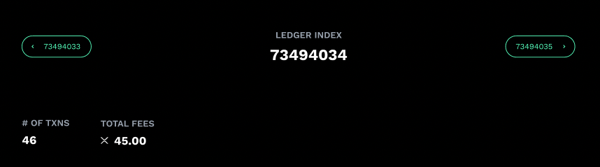

# Ledger Metrics

**Category:** Technical Documentation

**Proposed Amount:** $3,000

## Overview
When viewing a particular ledger (e.g. [Ledger Page](https://livenet.xrpl.org/ledgers/69537171)) in addition to showing a table of transaction a collection of metrics for the ledger should be show.

## Details
The following metrics should be shown above the transaction table and accompanied with `95%` code coverage.

- Current stats
	- Number of transactions (currently shown)
	- Total Fees (currently shown)
- Milestone 1 Stats
	- Number of successful transactions
	- Number of failed transactions (tec*)
	- Breakdown of transactions by type (DEX, Payments, Account, NFT, XChain)
	- A special call out (icon) if there are no tecINVARIANT_FAILED transactions
- Milestone 2 Stats
	- Summaries of the amount of ledger objects by type (Accounts, Offers, Escrows, TrustLines, Paychannel, etc.)
	
### Proposed Visuals
The new data should follow the design below.  It shows what it would look like with the current metrics.  The new metrics would use the same styling

## Milestones

| # | Description | Details | Proposed Potential Award |
| --- | --- | --- | --- |
| 1 | Display transaction summary | The statistics for Milestone 1 listed above | $1,000 |
| 2 | Add Object Counts | The statistics for Milestone 2 listed above | $2,000 |

## Helpful Links and Resources

- [Current Ledger Header Code](https://github.com/ripple/explorer/blob/staging/src/containers/Ledger/index.js#L87-L141)
- [Ledger Websocket Call](https://xrpl.org/websocket-api-tool.html#ledger)
- [List of Types](https://xrpl.org/ledger-object-types.html)

**Ripple internal ID:** DGE-355

